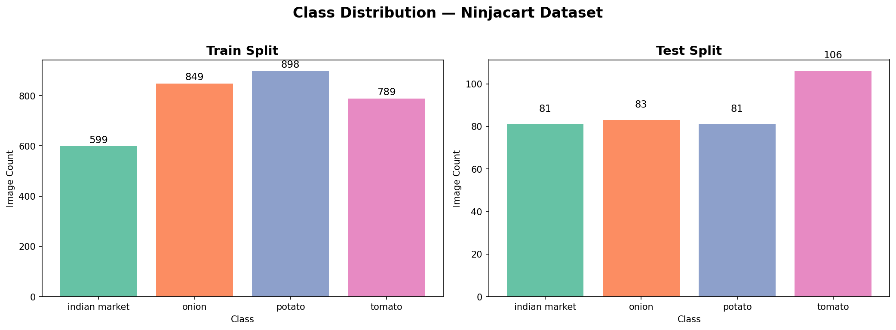
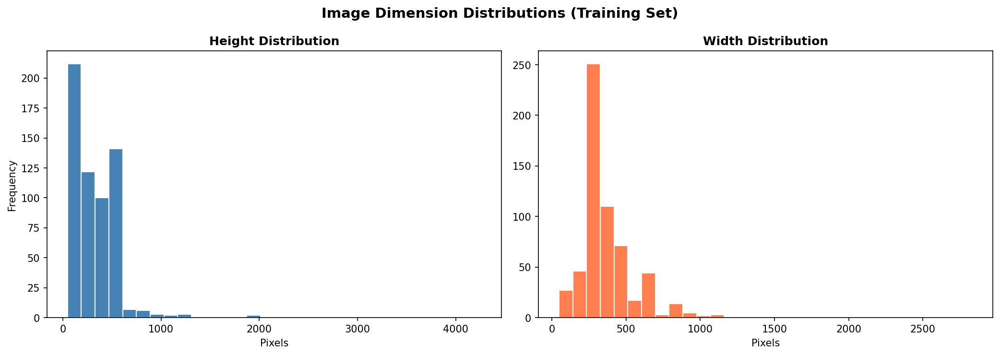
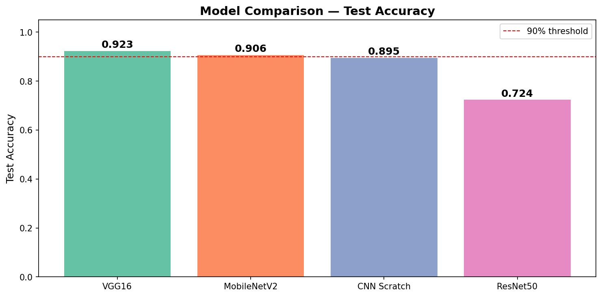
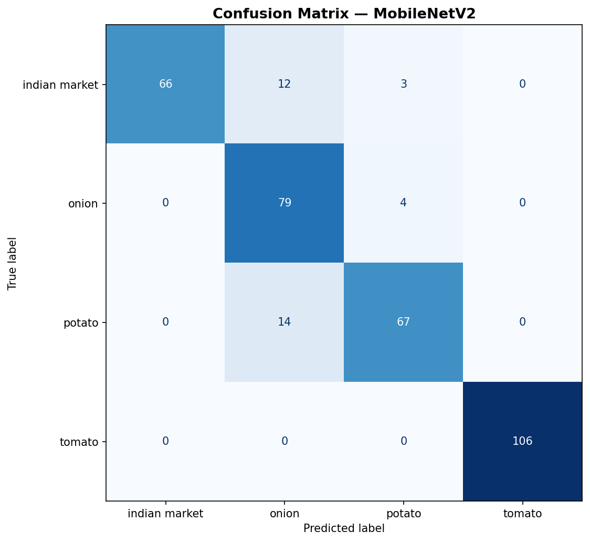
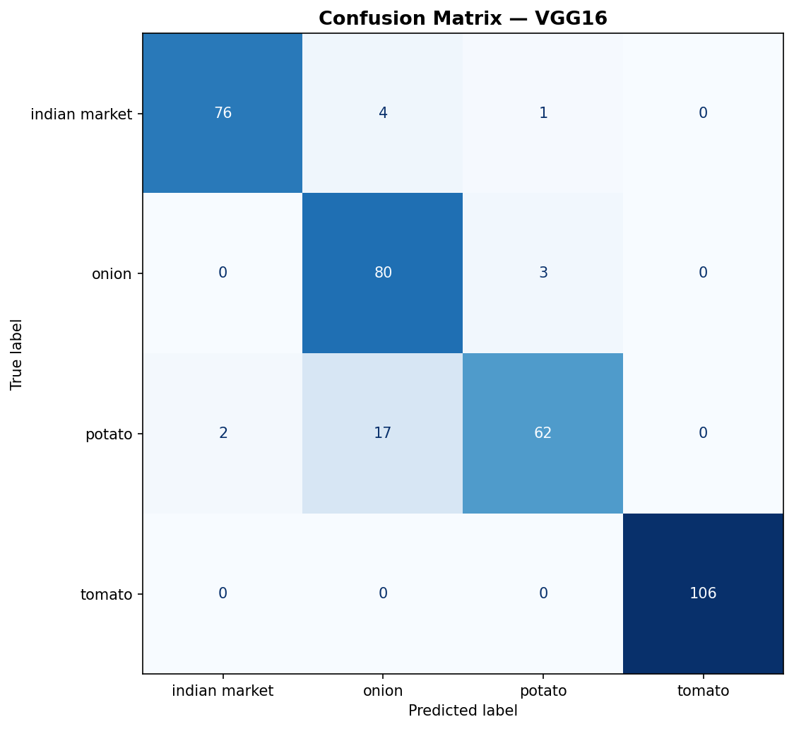

<](https://www.python.org/)
[](https://www.tensorflow.org/)
[](https://keras.io/)
[](https://jupyter.org/)
[](LICENSE)

</div>

---

## 📌 Project Overview

This project builds a **multi-class vegetable image classification system** for [Ninjacart](https://www.ninjacart.com/), India's largest B2B fresh produce supply chain platform. The goal is to automate vegetable identification using computer vision — enabling faster quality assessment, reduced manual effort, and smarter inventory management across the supply chain.

Five deep learning architectures were trained, evaluated, and compared:

| Model | Type | Notes |
|---|---|---|
| CNN from Scratch | Custom Architecture | Baseline — trained from scratch |
| VGG16 (Transfer Learning) | Feature Extraction | Frozen base, trained top layers |
| VGG16 (Fine-Tuned) | Fine-Tuning | Full model unfrozen and retrained |
| MobileNetV2 (Transfer Learning) | Feature Extraction | Lightweight & fast |
| MobileNetV2 (Fine-Tuned) | Fine-Tuning | Best accuracy-speed tradeoff |
| ResNet50 (Transfer Learning) | Feature Extraction | Deep residual network |
| ResNet50 (Fine-Tuned) | Fine-Tuning | Strong generalisation |

---

## 🗂️ Repository Structure

```
Ninjacart-CV-Classification/
│
├── 📓 notebooks/
│   └── Ninjacart_CV_Classification.ipynb   ← Full end-to-end pipeline
│
├── 🤖 models/
│   ├── CNN_Scratch_best.keras               ← Saved CNN baseline
│   └── MobileNetV2_FT_best.keras           ← Saved MobileNetV2 fine-tuned
│   # VGG16_FT_best.keras                   ← Not committed (117MB > GitHub limit)
│   #                                           See "Downloading Models" section below
│
├── 📊 reports/
│   ├── Ninjacart_CV_Classification.pdf      ← Exported notebook report
│   └── figures/
│       ├── class_distribution.png
│       ├── dimension_distribution.png
│       ├── model_comparison.png
│       ├── sample_images.png
│       ├── MobileNetV2_cm.png
│       └── VGG16_cm.png
│
├── 📈 logs/                                 ← TensorBoard training logs
│   ├── CNN_Scratch/
│   ├── MobileNetV2_FT/
│   ├── MobileNetV2_TL/
│   ├── ResNet50_FT/
│   ├── ResNet50_TL/
│   ├── VGG16_FT/
│   └── VGG16_TL/
│
├── .gitignore
└── README.md
```

---

## 📸 Dataset

The dataset contains labeled images of fresh vegetables across multiple categories collected from Ninjacart's supply chain operations.

**Key stats:**
- Multiple vegetable classes (tomatoes, onions, potatoes, etc.)
- Real-world supply chain images — varying lighting, backgrounds, and produce quality
- Train / Validation split applied during training

### Sample Images


### Class Distribution



### Image Dimension Distribution



---

## 🏗️ Model Architecture & Training

All models were trained using **TensorFlow/Keras** with the following strategy:

- **Data Augmentation**: Random flips, rotations, zoom, brightness adjustments
- **Optimiser**: Adam with learning rate scheduling
- **Loss**: Categorical Cross-Entropy
- **Callbacks**: ModelCheckpoint, EarlyStopping, ReduceLROnPlateau, TensorBoard
- **Hardware**: GPU-accelerated training

### Model Comparison



---

## 📊 Results

### Confusion Matrices

| MobileNetV2 (Fine-Tuned) | VGG16 (Fine-Tuned) |
|---|---|
|  |  |

---

## 🚀 Getting Started

### Prerequisites

```bash
pip install tensorflow keras numpy matplotlib seaborn scikit-learn pandas pillow
```

### Clone the Repository

```bash
git clone https://github.com/rambawankule/Ninjacart-CV-Classification.git
cd Ninjacart-CV-Classification
```

### Run the Notebook

```bash
jupyter notebook notebooks/Ninjacart_CV_Classification.ipynb
```

### View TensorBoard Logs

```bash
tensorboard --logdir logs/
```
Then open `http://localhost:6006` in your browser.

---

## 📥 Downloading Models

The `VGG16_FT_best.keras` model (117 MB) exceeds GitHub's file size limit and is **not included** in this repository.

| Model File | Size | Included |
|---|---|---|
| `CNN_Scratch_best.keras` | 5.6 MB | ✅ Yes |
| `MobileNetV2_FT_best.keras` | 23 MB | ✅ Yes |
| `VGG16_FT_best.keras` | 117 MB | ❌ No (too large) |

To regenerate `VGG16_FT_best.keras`, run the full notebook — it will retrain and save the model automatically.

---

## 🛠️ Tech Stack

| Category | Tools |
|---|---|
| Language | Python 3.9+ |
| Deep Learning | TensorFlow 2.x, Keras |
| Data Processing | NumPy, Pandas, Pillow |
| Visualisation | Matplotlib, Seaborn |
| Evaluation | Scikit-learn |
| Experiment Tracking | TensorBoard |
| Environment | Jupyter Notebook |

---

## 💡 Key Takeaways

- **Transfer Learning dramatically outperforms training from scratch** on small-to-medium datasets
- **Fine-tuning pre-trained models** provides the best balance of accuracy and training time
- **MobileNetV2 (Fine-Tuned)** offers the best accuracy-to-compute tradeoff — ideal for production deployment
- **Data augmentation** significantly reduces overfitting and improves generalisation
- TensorBoard logs enable transparent tracking of training dynamics across all 7 experiments

---

## 👤 Author

**Ram Bawankule**
- 📧 [rambawankule25@gmail.com](mailto:rambawankule25@gmail.com)
- 🐙 [GitHub](https://github.com/rambawankule)

---

## 📄 License

This project is licensed under the **MIT License** — see the [LICENSE](LICENSE) file for details.

---

<div align="center">
  <sub>Built with ❤️ for Ninjacart's supply chain automation</sub>
</div>
]]>
